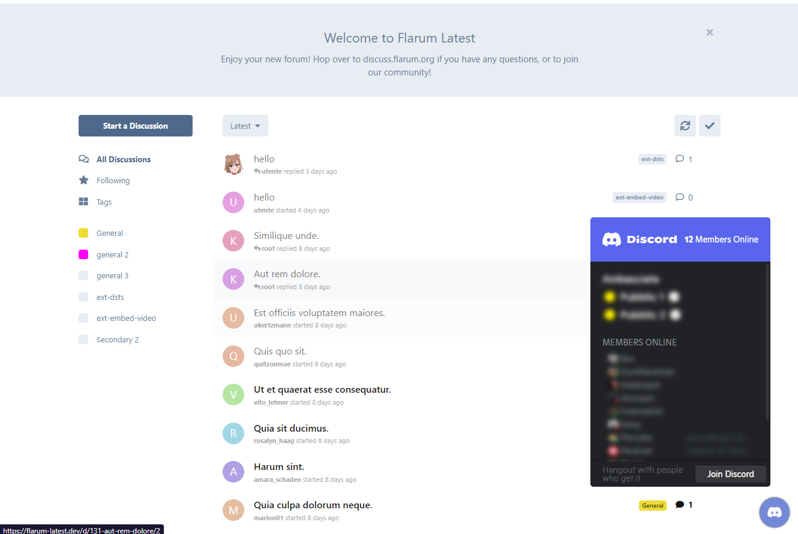

# Discord Widget

[](https://github.com/Nearata/flarum-ext-discord-widget/blob/main/UNLICENSE)
[](https://packagist.org/packages/nearata/flarum-ext-discord-widget)
[](https://github.com/Nearata/flarum-ext-discord-widget/blob/main/CHANGELOG.md)

> Adds a floating Discord widget.



## Install

```sh
composer require nearata/flarum-ext-discord-widget:"*"
```

## Update

```sh
composer update nearata/flarum-ext-discord-widget:"*"
php flarum cache:clear
```

## Remove

```sh
composer remove nearata/flarum-ext-discord-widget
php flarum cache:clear
```
